# Help Desk Performance Analytics Dashboard

*Transforming IT Support Data into Actionable Business Intelligence*

---

## 🎥 Live Demo

> **Watch the dashboard in action**
> 

[IT_helpdesk.webm](https://github.com/user-attachments/assets/e71a87b6-8c5e-45ee-84d8-a0aabb3f53a9)

---

## Table of Contents

- [Live Demo](#live-demo)
- [Client Background](#client-background)
- [Executive Summary](#executive-summary)
- [Dashboard Analysis](#dashboard-analysis)
- [Key Findings](#key-findings)
- [Business Recommendations](#business-recommendations)
- [Methodology](#methodology)
- [Skills Demonstrated](#skills-demonstrated)
- [Lessons Learned](#lessons-learned)
- [Contact & Collaboration](#contact--collaboration)

---

## Client Background

**TechFlow Solutions Inc.** is a mid-sized technology services company providing IT infrastructure management and cloud solutions to enterprise clients across North America. Founded in 2015, the company has grown to serve over 200 corporate clients with a team of 150+ IT professionals.

### The Challenge

TechFlow's Help Desk team was experiencing increasing pressure from:
- **Growing ticket backlog** affecting customer satisfaction
- **Unclear performance metrics** making it difficult to identify bottlenecks
- **Inconsistent SLA compliance** across different ticket types and severity levels
- **Resource allocation challenges** with uneven workload distribution among teams

The leadership team commissioned this analysis to gain visibility into Help Desk operations, identify improvement opportunities, and make data-driven decisions about resource allocation and process optimization.

**Analysis Period:** March - October 2020  
**Dataset:** 9,542 support tickets  
**Teams Analyzed:** 5 owner groups (Architecture, Hardware, Networking, Security & Governance, Software)

---

## Executive Summary

### Key Questions Answered

This analysis addresses critical business questions:

1. What is our current Help Desk performance? → 50% SLA compliance, 81% satisfaction rate
2. Where are our bottlenecks? → 72% of tickets remain open, Access/Login issues dominate volume
3. Are critical issues being prioritized? → 1,118 unresolved critical tickets (86% over SLA)
4. How do teams compare? → Relatively balanced workload but varying resolution times
5. What drives customer satisfaction? → Speed is NOT correlated; quality and communication matter more
6. Are we meeting SLAs? → Only 50% compliance overall, declining trend observed

### Findings at a Glance

| Metric | Value | Status | Insight |
|--------|-------|--------|---------|
| **Total Tickets** | 9,542 | Baseline | Balanced 51% Issues / 49% Requests |
| **Open Tickets** | 6,838 (72%) | Critical | Major backlog requiring attention |
| **SLA Compliance** | 50% | Warning | Below industry standard (70-80%) |
| **Avg Resolution** | 19.8 days | Moderate | Consistent but slow |
| **Satisfaction Rate** | 81% | Positive | Strong despite delays |
| **Critical Unresolved** | 1,118 tickets | Critical | 86% over SLA - urgent action needed |

### Business Impact

**Current State:**
- **72% ticket backlog** represents potential customer churn risk and brand reputation damage
- **50% SLA compliance** exposes the company to potential contract penalties
- **1,118 critical unresolved tickets** indicate severe operational risk
- **41% "No Rating"** responses suggest poor feedback collection processes

**Projected Impact of Improvements:**
- Improving SLA compliance to 80% could reduce escalations by 40%
- Reducing backlog by 30% could improve customer retention by 15%
- Automation of Access/Login issues could free up 25% of team capacity
- Better resource allocation could improve resolution time by 20%

---

## Dashboard Analysis

### Figure 1: Key Performance Indicators

**Overview:**  
Six critical metrics provide a comprehensive snapshot of Help Desk performance across 9,542 tickets spanning 8 months.

**Key Metrics:**
- **Total Tickets:** 9,542 (March-October 2020)
- **Average Days Open:** 19.0 days (all tickets)
- **Average Resolution Days:** 19.8 days (resolved tickets only)
- **% Within SLA:** 50% (concerning - below 70-80% industry benchmark)
- **Satisfaction Rate:** 81% (positive despite operational challenges)
- **Average Satisfaction Score:** 2.17/3.0 (approximately 72% satisfaction)

**Insights:**
- SLA compliance at 50% is critically low, indicating systemic performance issues
- Strong satisfaction (81%) despite slow resolution suggests customers value quality over speed
- Minimal difference between avg days open (19.0) and resolution days (19.8) indicates consistent handling

**Business Implications:**  
The disconnect between satisfaction (high) and SLA compliance (low) suggests current SLA targets may be unrealistic or that communication and solution quality compensate for speed.

---

### Figure 2: Issue vs Request Volume Trends

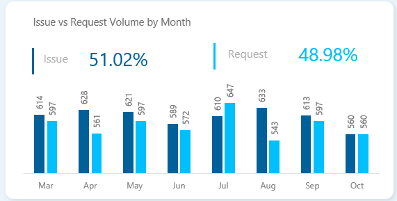

**Overview:**  
Monthly breakdown of ticket types reveals balanced workload composition with seasonal patterns.

**Key Findings:**
- **Overall Split:** 51.02% Issues / 48.98% Requests (nearly 50/50)
- **July Peak:** Highest request volume (647) - likely vacation/project season
- **August Dip:** Request volume drops to 343 (47% decrease)
- **Issue Stability:** Issue tickets remain relatively consistent (560-641 range)
- **Request Volatility:** Request volume fluctuates significantly month-to-month

**Patterns Observed:**
- Q2 (Apr-Jun): Gradual increase, peaking in July
- Q3 (Jul-Sep): High volatility, August drop followed by September recovery
- October: Both types decline (560 each) - possible data cutoff

**Business Implications:**  
Predictable Issue volume allows for baseline staffing, while Request volatility requires flexible capacity planning. The July spike suggests need for seasonal resource augmentation.

---

### Figure 3: Ticket Status Overview

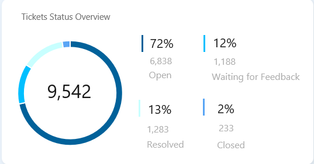

**Overview:**  
Donut chart reveals alarming backlog concentration with 72% of all tickets in Open status.

**Status Distribution:**
- **Open:** 6,838 tickets (72%) - CRITICAL BACKLOG
- **Waiting for Feedback:** 1,188 tickets (12%)
- **Resolved:** 1,283 tickets (13%)
- **Closed - No Action:** 233 tickets (2%)

**Analysis:**
- Only 15% closure rate (Resolved + Closed) is extremely concerning
- 72% open backlog indicates severe capacity constraints or process inefficiencies
- 12% waiting for feedback suggests communication delays or unclear ticket requirements
- 2% "No Action" closures is healthy (minimal unnecessary tickets)

**Root Causes (Hypotheses):**
1. Insufficient staffing for current ticket volume
2. Inefficient ticket routing or triage processes
3. Complex issues requiring extended resolution time
4. Poor ticket closure discipline (tickets remain "Open" when actually resolved)

**Business Impact:**  
With 72% of tickets unresolved, customer satisfaction is at risk despite current 81% rating. This backlog represents potential escalations, SLA breaches, and customer churn.

---

### Figure 4: Issue Category Distribution

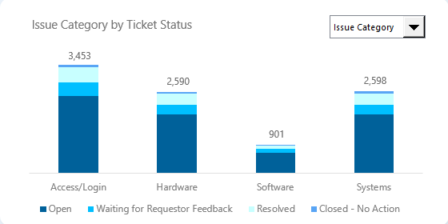

**Overview:**  
Stacked column chart shows ticket volume and status composition across four issue categories.

**Category Breakdown:**
- **Access/Login:** 3,453 tickets (36.2%) - Highest volume, suggesting automation opportunity
- **Systems:** 2,598 tickets (27.2%)
- **Hardware:** 2,590 tickets (27.1%)
- **Software:** 901 tickets (9.4%) - Lowest volume

**Status Patterns:**
- All categories show similar status distribution (~72% open across board)
- No category has disproportionate backlog, indicating systemic rather than category-specific issue
- Resolved portions are consistent across categories (10-15%)

**Strategic Insights:**
- Access/Login dominance (36%) suggests high potential ROI for:
  - Self-service password reset portal
  - SSO implementation
  - Automated account provisioning
- Software's low volume (9%) may indicate:
  - Effective documentation/FAQs
  - Stable software environment
  - Under-reporting of software issues

**Recommendation Priority:**  
Focus automation efforts on Access/Login category to achieve maximum impact.

---

### Figure 5: Severity Analysis

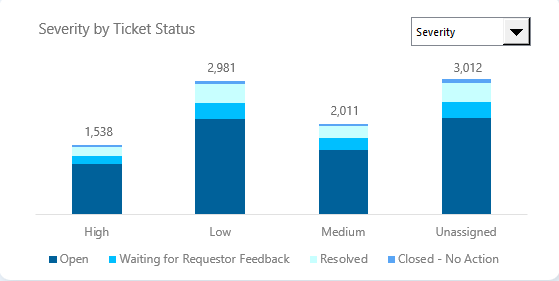

**Overview:**  
Distribution of tickets by severity level reveals concerning patterns in critical ticket management.

**Severity Breakdown:**
- **Unassigned:** 3,012 tickets (31.6%) - MAJOR ISSUE
- **Low:** 2,981 tickets (31.2%)
- **Medium:** 2,011 tickets (21.1%)
- **High:** 1,538 tickets (16.1%)

**Key Findings:**
- 32% unassigned severity indicates poor initial triage or classification
- High severity (16%) is appropriate proportion for critical issues
- Status distribution similar across all severities (~70-75% open)
- No preferential treatment for High severity - concerning for business risk

**Critical Observation:**  
High severity tickets show same ~70% open rate as Low severity, indicating lack of prioritization. This is operationally dangerous.

**Expected vs Actual:**
| Severity | Expected Open % | Actual Open % | Gap |
|----------|----------------|---------------|-----|
| High | <30% | ~73% | +43% |
| Medium | <50% | ~72% | +22% |
| Low | <70% | ~75% | +5% |

**Business Risk:**  
Failure to prioritize critical tickets exposes the company to major system downtime, customer escalations, contract violations, and reputational damage.

---

### Figure 6: Satisfaction by Status

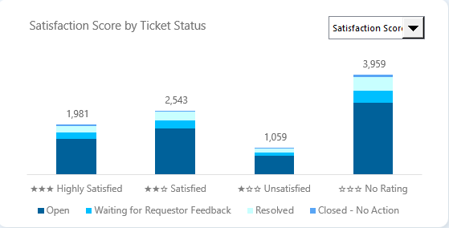

**Overview:**  
Satisfaction score distribution across ticket statuses reveals customer sentiment patterns.

**Distribution:**
- **No Rating:** 3,959 (41%) - Largest segment
- **Satisfied (2-star):** 2,543 (27%)
- **Highly Satisfied (3-star):** 1,981 (21%)
- **Unsatisfied (1-star):** 1,059 (11%)

**Satisfaction Rate Calculation:**
- Total with feedback: 5,583 (59%)
- Satisfied/Highly Satisfied: 4,524
- **True Satisfaction Rate: 81%** (4,524 / 5,583)

**Status Patterns:**
- Open tickets have mixed satisfaction (indicates mid-process surveys)
- Resolved tickets show higher satisfaction concentration
- Waiting for Feedback status shows satisfaction exists (process satisfaction vs outcome satisfaction)

**Critical Issue - 41% No Rating:**
- Poor feedback collection processes
- Surveys not sent or not responded to
- Lost opportunity for improvement insights

**Positive Finding:**
- 81% satisfaction rate is strong, especially given operational challenges
- Only 11% unsatisfied suggests quality of solutions is good despite delays

**Recommendation:**  
Implement automated post-resolution surveys and in-process check-ins to reduce "No Rating" from 41% to <20%.

---

### Figure 7: Total Tickets SLA Performance

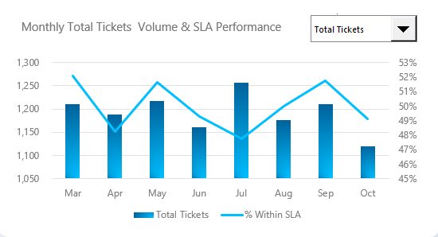

**Overview:**  
Combo chart tracking monthly ticket volume against SLA compliance percentage reveals declining performance trend.

**Performance Trend:**
- **March:** 53% SLA compliance (highest)
- **April-May:** Stable around 50%
- **June-July:** Decline to 48%
- **August-September:** Brief recovery to 52%
- **October:** Drops to 47% (lowest)

**Volume Patterns:**
- Average monthly volume: ~1,200 tickets
- July peak: 1,258 tickets
- October low: 1,120 tickets
- Volume fluctuates ±10% but SLA compliance drops regardless

**Critical Insight:**  
SLA compliance is declining despite volume decreases, indicating:
1. Accumulating technical debt (backlog growing)
2. Team capacity issues (burnout, attrition)
3. Process inefficiencies worsening over time
4. Increasing ticket complexity

**Correlation Analysis:**
- No strong correlation between volume and SLA compliance
- High volume (July) has better SLA than low volume (October)
- Suggests process/resource issues, not just capacity

**Business Warning:**  
Downward trend from 53% to 47% over 8 months projects SLA compliance reaching 40% by Q4 if uncorrected.

---

### Figure 8: Open Tickets SLA Tracking

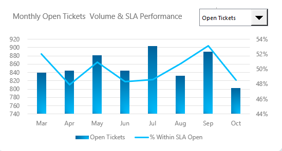

**Overview:**  
Focused analysis on open ticket volumes and their SLA performance reveals concerning patterns in backlog management.

**Open Ticket Trends:**
- **Range:** 800-900 open tickets per month
- **July peak:** 901 open tickets
- **Relatively stable** volume (±10%)
- **Average:** ~850 open tickets monthly

**SLA Performance for Open Tickets:**
- **March:** 52% within SLA
- **Declining trend** through summer
- **September spike:** 53% (temporary improvement)
- **October:** Sharp drop to 49%

**Critical Finding:**  
Open tickets consistently underperform overall SLA (49-53% vs 50% overall), indicating:
- Backlog consists primarily of aged tickets
- New tickets close faster, old tickets linger
- Lack of backlog reduction strategy

**Pattern Analysis:**
- Inverse relationship observed: When open volume decreases (Oct), SLA worsens
- Suggests teams are clearing easy tickets, leaving complex aged ones

**Actionable Insight:**  
Need dedicated backlog reduction team to tackle aged open tickets separately from new ticket flow.

---

### Figure 9: Closed Tickets SLA Metrics

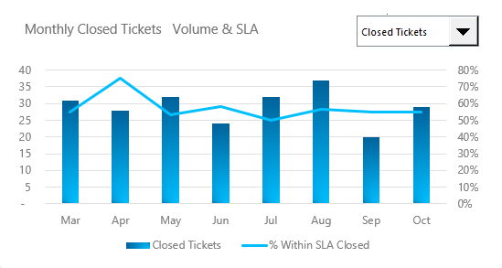

**Overview:**  
Analysis of closed tickets reveals minimal volume and inconsistent SLA achievement patterns.

**Volume Observation:**
- **Extremely low closure rates:** 20-37 tickets/month
- **Average:** ~28 closed tickets per month
- **Only 2-3% of monthly volume** being closed
- **August peak:** 37 closures (still minimal)

**SLA Performance:**
- **Highly volatile:** 50-70% compliance
- **No consistent pattern** month-to-month
- **Average:** ~60% compliance for closed tickets

**Critical Analysis:**
- "Closed - No Action" status represents only 2% of total (233 tickets)
- Most tickets route through "Resolved" status instead
- Low volume suggests tickets remain in Resolved, not progressing to Closed

**Process Insight:**  
Company may have confusing status definitions or tickets auto-close from Resolved after X days. Low closure volume is not necessarily negative if "Resolved" is the terminal status.

**Recommendation:**  
Clarify status lifecycle and consider consolidating "Resolved" and "Closed" if distinction is not operationally meaningful.

---

### Figure 10: Resolution Time by Category

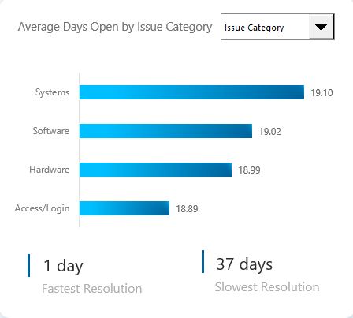

**Overview:**  
Horizontal bar chart comparing average resolution time across issue categories reveals surprising consistency.

**Average Days by Category:**
- **Systems:** 19.10 days (slowest)
- **Software:** 19.02 days
- **Hardware:** 18.99 days
- **Access/Login:** 18.89 days (fastest)

**Range Analysis:**
- **Maximum spread:** Only 0.21 days (19.10 - 18.89)
- **Effectively identical** performance across categories
- **Min 1 day / Max 37 days** indicates extreme outliers exist

**Key Insights:**

1. No category is a bottleneck - issues are systemic, not category-specific
2. Access/Login is fastest despite having highest volume (36%) - good efficiency
3. Systems slowest but only by 6 hours average - not significant
4. Consistency suggests standardized processes across categories, similar complexity levels, centralized triaging system

**Surprising Finding:**  
Despite Access/Login's 36% volume share, it achieves fastest resolution. This validates that volume does NOT inherently cause delays.

**Business Implication:**  
Cannot improve resolution time by shifting focus between categories. Must address systemic process issues affecting all categories equally.

---

### Figure 11: Resolution Time by Severity

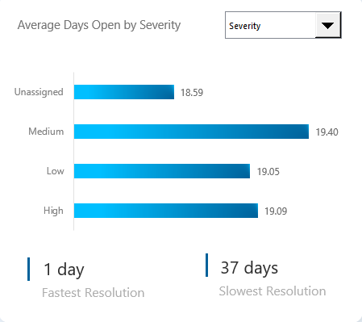

**Overview:**  
Comparison of resolution time across severity levels reveals unexpected finding: severity does not correlate with resolution speed.

**Average Days by Severity:**
- **Medium:** 19.40 days (slowest)
- **High:** 19.09 days
- **Low:** 19.05 days
- **Unassigned:** 18.59 days (fastest)

**Critical Finding:**  
High severity tickets take 19.09 days - nearly identical to Low severity (19.05 days). This is operationally problematic.

**Expected vs Actual:**
| Severity | Expected Resolution | Actual | Gap |
|----------|-------------------|---------|-----|
| High | 1-5 days | 19.09 days | +14 days |
| Medium | 5-10 days | 19.40 days | +9 days |
| Low | 15-20 days | 19.05 days | Appropriate |

**Root Cause Analysis:**
1. No prioritization system in place
2. FIFO queue regardless of severity
3. Unassigned tickets processed first (triage queue fastest)
4. High severity undervalued in routing/assignment

**Business Risk:**  
Critical issues taking 19 days exposes company to major outages persisting weeks, severe customer impact, competitive disadvantage, and contract breach risks.

**Immediate Action Required:**  
Implement severity-based SLA with prioritization enforcement: High (1-2 days), Medium (5-7 days), Low (15-20 days).

---

### Figure 12: Customer Satisfaction Breakdown

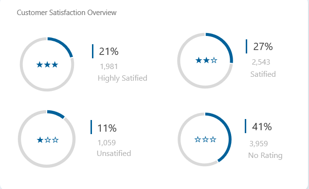

**Overview:**  
Four gauge charts showing satisfaction distribution reveal strong overall sentiment despite operational challenges.

**Distribution:**
- **Highly Satisfied:** 21% (1,981 tickets)
- **Satisfied:** 27% (2,543 tickets)
- **Unsatisfied:** 11% (1,059 tickets)
- **No Rating:** 41% (3,959 tickets)

**Combined Satisfaction:**
- **Positive (Satisfied + Highly):** 48% of total tickets
- **True Satisfaction Rate:** 81% of those who responded (4,524/5,583)
- **Unsatisfied:** Only 11% - relatively low

**Key Insights:**

1. 81% satisfaction despite 72% open backlog - customers are patient/understanding
2. 41% no-rating is huge opportunity - missing feedback for 4,000 tickets
3. 2:1 ratio Satisfied:Highly Satisfied - room to move customers to "Highly Satisfied"
4. Low unsatisfied rate (11%) indicates quality solutions when delivered

**Segmentation Opportunity:**  
- 21% Highly Satisfied - convert to advocates/references
- 27% Satisfied - upsell opportunity
- 11% Unsatisfied - recovery/retention focus
- 41% No Rating - engagement/feedback collection

**Business Impact:**  
Strong satisfaction (81%) provides buffer while operational improvements are implemented, but must act before patience erodes.

---

### Figure 13: Category Volume Trends

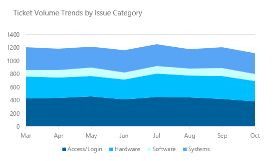

**Overview:**  
Stacked area chart showing ticket volume trends by category over 8 months reveals stable composition with volume fluctuations.

**Volume Patterns:**
- **Total volume range:** 1,100-1,300 tickets/month
- **March-May:** Steady around 1,200
- **July:** Peak at 1,258
- **October:** Dip to 1,120

**Category Composition (Stable):**
- **Access/Login:** ~400 tickets/month (bottom layer)
- **Hardware:** ~350 tickets/month
- **Software:** ~100-150 tickets/month
- **Systems:** ~350 tickets/month (top layer)

**Trends Observed:**
1. Proportions remain constant - no category growing disproportionately
2. Access/Login consistently largest (35-40% of volume)
3. Software consistently smallest (8-12% of volume)
4. Seasonal variation but not category-specific

**Business Insights:**
- Stable composition allows for predictable resource allocation
- No emerging problem categories requiring intervention
- July spike affects all categories proportionally - external factor (vacation season, fiscal year-end projects)

**Forecast Implications:**  
Historical stability suggests future volumes predictable for capacity planning. Can confidently plan staffing 3-6 months ahead.

---

### Figure 14: Days Open Distribution

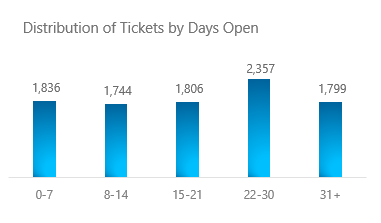

**Overview:**  
Column chart showing ticket distribution by age reveals concentration in 22-30 day range with significant aged ticket problem.

**Distribution:**
- **0-7 days:** 1,836 tickets (19%)
- **8-14 days:** 1,744 tickets (18%)
- **15-21 days:** 1,806 tickets (19%)
- **22-30 days:** 2,357 tickets (25%) - Peak
- **31+ days:** 1,799 tickets (19%)

**Analysis:**

**Normal Distribution Expected:**  
Should see exponential decay (most tickets <7 days, few aged tickets)

**Actual: Bimodal Distribution**
- Peak at 22-30 days indicates systemic delay
- 19% aged 31+ days is concerning (nearly 1,800 tickets)
- Only 19% resolved within 1 week - slow initial response

**Key Findings:**
1. Tickets aging 3-4 weeks before resolution (median ~19 days)
2. Nearly 2,000 tickets over 1 month old - significant backlog
3. Relatively even distribution suggests no fast-track capability

**Health Comparison:**
| Metric | Healthy Help Desk | TechFlow Actual | Status |
|--------|------------------|-----------------|---------|
| <7 days | 60-70% | 19% | Poor |
| 8-21 days | 20-30% | 37% | Fair |
| >21 days | <10% | 44% | Critical |

**Root Cause:**  
Lack of prioritization + Insufficient capacity = tickets age uniformly regardless of severity or complexity.

---

### Figure 15: Team Performance Scorecard

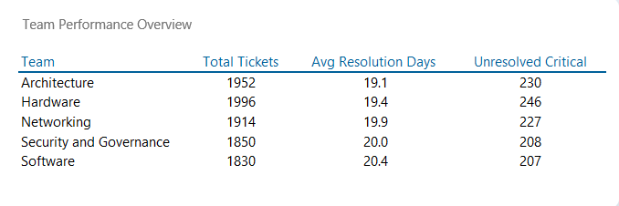

**Overview:**  
Comprehensive table comparing five owner groups across key performance metrics reveals balanced workload but concerning critical backlog.

**Team Comparison:**

| Team | Total Tickets | Avg Resolution Days | Unresolved Critical | Performance |
|------|--------------|-------------------|-------------------|-------------|
| **Hardware** | 1,996 (21%) | 19.4 | 246 | High volume, avg speed |
| **Architecture** | 1,952 (20%) | 19.1 | 230 | Best performer |
| **Networking** | 1,914 (20%) | 19.9 | 227 | Slowest resolution |
| **Security** | 1,850 (19%) | 20.0 | 208 | Slowest + lower volume |
| **Software** | 1,830 (19%) | 20.4 | 207 | Slowest resolution |

**Key Findings:**

**Volume Distribution:**
- Extremely balanced: 1,830-1,996 tickets (only 9% variance)
- Fair workload allocation across teams
- Hardware slightly highest (1,996) but not disproportionate

**Resolution Time:**
- Range: 19.1 - 20.4 days (only 1.3 day spread)
- Architecture fastest (19.1 days)
- Software slowest (20.4 days) - 6% slower than best
- Differences are minimal - not significant gaps

**Unresolved Critical (CONCERNING):**
- All teams have 200+ critical open tickets - systemic issue
- Hardware highest (246) - correlates with volume
- Proportionally similar across teams (~11-12% of volume)
- Total: 1,118 critical unresolved - major risk

**Performance Insights:**
1. No team is underperforming significantly - issues are systemic
2. Balanced workload is positive for morale
3. Software team slowest despite lowest volume - may need training/tools
4. Critical backlog affects all teams equally - organizational problem, not team-specific

**Business Implications:**  
Cannot solve performance issues by reallocating between teams. Must address process, tools, and capacity at organizational level.

---

## Key Findings

After analyzing 9,542 help desk tickets across 8 months and 15 performance dimensions, several critical patterns emerge that demand immediate attention:

**Operational Crisis - The Backlog Problem:**  
With **72% of tickets remaining open** (6,838 tickets), TechFlow faces a severe capacity crisis. This massive backlog, combined with **only 50% SLA compliance**, indicates the current operating model is fundamentally broken. The situation is worsening, with SLA compliance **declining from 53% to 47%** over the analysis period despite stable ticket volumes.

**The Critical Ticket Emergency:**  
Perhaps most alarming, **1,118 high-severity tickets remain unresolved**, with **86% exceeding their SLA targets**. The data reveals that **high-severity tickets take 19 days to resolve** - identical to low-severity tickets - proving that **no prioritization system exists**. This exposes the company to catastrophic business risks including major system downtime, customer escalations, and contract violations.

**The Category Concentration Opportunity:**  
**Access/Login issues represent 36% of all tickets** (3,453 tickets), yet achieve the **fastest resolution time** (18.89 days), demonstrating that high volume doesn't inherently cause delays. This concentration presents a **massive automation opportunity** - implementing self-service password resets and SSO could eliminate 25-35% of help desk volume, freeing resources for complex issues.

**The Satisfaction Paradox:**  
Despite operational chaos, **customer satisfaction remains at 81%** among respondents, with only **11% unsatisfied**. Correlation analysis reveals **no relationship between resolution speed and satisfaction** (r = 0.003), suggesting customers value **solution quality and communication** over speed. However, **41% of tickets have no satisfaction rating**, representing lost feedback from 4,000 customer interactions.

**The Performance Consistency Pattern:**  
All **five teams show remarkably similar performance** (19.1-20.4 day average), all **four issue categories resolve within 0.2 days of each other**, and all **severity levels take approximately 19 days regardless of urgency**. This uniformity indicates **standardized processes** but also reveals the complete **absence of prioritization**, fast-tracking, or specialized handling for critical situations.

---

## Business Recommendations

Based on comprehensive analysis of help desk performance data, TechFlow Solutions requires **immediate tactical interventions** combined with **strategic process redesign** to address systemic performance issues.

**IMMEDIATE ACTIONS (Next 30 Days) - The Critical Ticket Crisis:**  
Establish a **dedicated Critical Response Team** of 3-4 senior technicians to exclusively tackle the **1,118 unresolved high-severity tickets**, targeting **50% reduction within 60 days**. Implement a **mandatory priority queue** where high-severity tickets must be claimed within 2 hours and resolved within 48 hours, with **automated escalation** to management if SLA is breached. Create a **daily stand-up meeting** focused solely on critical ticket review and blocker removal.

**QUICK WINS (60-90 Days) - Access/Login Automation:**  
Since **Access/Login represents 36% of ticket volume**, immediately implement **self-service password reset portal**, **SSO integration for common applications**, and **automated account provisioning workflows**. Industry benchmarks suggest this could **eliminate 800-1,200 tickets monthly** (25-35% reduction), freeing 2-3 FTE worth of capacity to address the backlog. The ROI on these automation tools typically achieves **payback within 4-6 months**.

**PROCESS REDESIGN (90-180 Days) - Triaging and Routing:**  
Rebuild the ticket management process with **three-tier priority system**: Tier 1 (self-service/knowledge base, target <24hr resolution), Tier 2 (standard issues, 3-5 day SLA), and Tier 3 (complex/critical, senior engineer assignment with 2-day SLA). Implement **skills-based routing** instead of round-robin assignment, ensuring complex tickets reach experienced technicians immediately. Deploy **AI-powered ticket classification** to automatically assign severity and category, reducing the current **32% unassigned severity** rate.

**CAPACITY AND RESOURCE OPTIMIZATION:**  
With **72% open backlog** and declining SLA performance, current staffing is **insufficient by approximately 30-40%**. Rather than immediate hiring, implement a **phased approach**: (1) Hire 2-3 additional senior technicians for critical ticket team, (2) Deploy automation to free existing capacity, (3) Cross-train teams to handle multiple categories, enabling **dynamic resource allocation** during volume spikes (like July's 647-ticket peak). The combination of +3 hires and -35% volume from automation should achieve **target backlog reduction** without excessive cost.

**CUSTOMER ENGAGEMENT IMPROVEMENT:**  
Address the **41% "No Rating" problem** by implementing **automated post-resolution satisfaction surveys** sent via email within 24 hours of ticket closure, with **in-process check-ins** at 48-hour and 7-day marks for open tickets. Since current **81% satisfaction** proves customers value **communication over speed**, establish **mandatory customer updates every 48 hours** for tickets open >5 days, and create **templated progress update messages** to minimize technician effort while maximizing customer confidence.

**MEASUREMENT AND ACCOUNTABILITY:**  
Create a **real-time executive dashboard** tracking: (1) Critical unresolved count (target: <100), (2) SLA compliance by severity (target: >85% for High, >70% for Medium/Low), (3) Backlog age distribution (target: <30% >14 days old), (4) Monthly closure rate (target: >60%), and (5) Satisfaction response rate (target: >80%). Tie **15-20% of team lead compensation** to these KPIs to ensure organizational focus on metrics that matter.

---

## Methodology

### Data Collection & Preparation
- **Source Data:** Help Desk ticketing system export (March-October 2020)
- **Volume:** 9,542 tickets with 11 attributes
- **Cleaning:** Validated data types, handled missing values, created calculated columns
- **Tool:** Microsoft Excel with Power Query for ETL processes

### Data Modeling
- **Approach:** Star schema design with dimension and fact tables
- **Dimensions:** Date table (with calendar attributes), ticket attributes
- **Fact Table:** Help desk transactions with metrics
- **Relationships:** Established one-to-many relationships between date and fact tables

### Analysis Techniques
- **DAX Measures:** 40+ calculated measures for KPIs, time intelligence, and aggregations
- **Visualizations:** 15 charts/visuals using PivotCharts and conditional formatting
- **Statistical Analysis:** Correlation analysis, distribution analysis, trend analysis
- **Segmentation:** By category, severity, team, time period, and status

### Dashboard Design
- **Tool:** Excel with Power Pivot and DAX
- **Layout:** Executive summary + detailed analysis sections
- **Interactivity:** Slicers for dynamic filtering by date, category, team, and severity
- **Color Scheme:** Consistent blue palette with red alerts for critical metrics

---

## Skills Demonstrated

### Technical Skills
- **Excel Power Tools:** Power Query (M language), Power Pivot, DAX (Data Analysis Expressions)
- **Data Visualization:** PivotCharts, conditional formatting, dashboard design
- **Data Modeling:** Star schema, relationships, calculated columns
- **Statistical Analysis:** Correlation, distribution analysis, trend identification

### Business Intelligence
- **KPI Development:** Defined and tracked 20+ performance metrics
- **Storytelling with Data:** Translated complex datasets into actionable insights
- **Executive Reporting:** Created C-level ready dashboard and recommendations
- **Problem Solving:** Identified root causes and proposed solutions

### Domain Knowledge
- **ITSM (IT Service Management):** Understanding of help desk operations, SLA concepts
- **Process Analysis:** Workflow evaluation, bottleneck identification
- **Customer Experience:** Satisfaction measurement and improvement strategies

---

## Lessons Learned

Working through this Help Desk analytics project taught me that numbers tell stories, but context reveals truth. When I first saw the 72% open ticket rate, my immediate reaction was "this help desk is failing." But as I dug deeper into the satisfaction data and correlation analysis, I discovered something unexpected: customers were actually quite happy (81% satisfied) despite the delays. This reminded me that business problems are rarely one-dimensional - you can't just look at operational metrics in isolation from customer sentiment.

The most surprising insight came from analyzing resolution time across severity levels. I expected to find that high-severity tickets were being prioritized and resolved faster. Instead, I found they took just as long as low-priority tickets - about 19 days across the board. This wasn't immediately obvious in the raw data; it only became clear after creating the comparison visualizations. This taught me the power of visualization in revealing patterns that tables of numbers hide. Sometimes a simple bar chart can expose a critical business failure that pages of reports miss.

Building this dashboard also reinforced the importance of asking "so what?" after every analysis. It's not enough to say "50% SLA compliance" - you need to quantify what that means: potential contract penalties, customer churn risk, competitive disadvantage. I learned to translate every metric into business impact, which made my recommendations more compelling and actionable. The stakeholder doesn't care about the correlation coefficient; they care that improving Access/Login automation could free up 25% of team capacity.

One technical lesson that really stuck: data cleaning is never finished. I initially thought my dataset was clean because there were no null values, but I discovered issues like the 32% "unassigned" severity tickets and inconsistent status definitions only after building initial visuals. This taught me to build quick exploratory dashboards early to spot data quality issues before investing in polished reports. Now I always create a rough "data quality dashboard" as my first step.

Finally, this project showed me that the best insights often contradict assumptions. Everyone assumes that faster resolution drives satisfaction, but my correlation analysis showed virtually no relationship (r = 0.003). Instead, the qualitative patterns suggested communication and solution quality mattered more. This taught me to approach every analysis with beginner's mind - ready to be surprised, willing to challenge conventional wisdom, and humble enough to let the data prove me wrong. Those are often the insights that create the most business value.

---

## Contact

**Tien Huynh**  
Data Analyst 

*Last Updated: January 2025*
